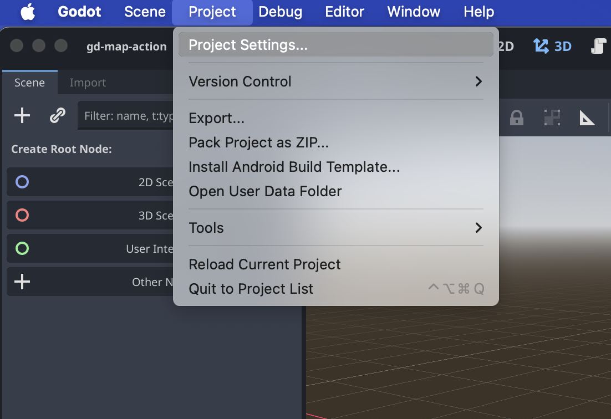
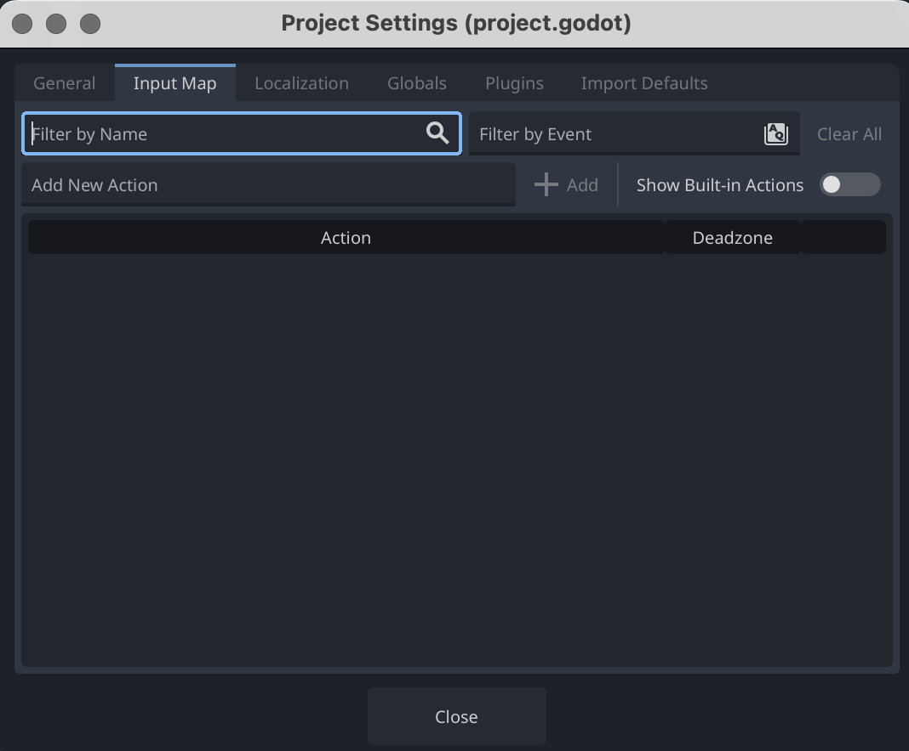
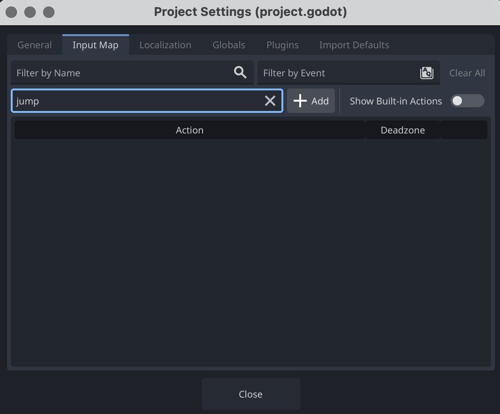

# Input map

## Qu'est‑ce que l'Input Map ?
L'Input Map est la couche d'abstraction entre les événements matériels (touches, souris, manette) et les actions logiques du jeu. Au lieu de tester directement des touches (ex. "Espace"), on teste des actions sémantiques (ex. "jump", "play_sound"). Cela facilite le rebinding, le support manette et la maintenance.

## Où configurer ?
Project → Project Settings → Input Map.  
- Ajouter une action (ex. "jump", "play_sound").  
- Assigner une ou plusieurs entrées : touches clavier, boutons souris, boutons de manette, axes.

* 

* 

* 

## Utilisation en code (GDScript)
- Vérifier un appui :
  - Input.is_action_just_pressed("action_name")
  - Input.is_action_pressed("action_name")
  - Input.is_action_just_released("action_name")

Exemple :
```gdscript
# play_sound.gd
if Input.is_action_just_pressed("play_sound"):
    $AudioStreamPlayer.play()
```

## Bonnes pratiques
- Nommer les actions de façon sémantique (ex. "move_left", "menu_accept", "trigger_pad").
- Ne pas hardcoder les touches dans le code.
- Proposer plusieurs bindings (clavier + manette).
- Documenter l'Input Map dans le README du projet pour faciliter les tests et le QA.

## Debug / test
- Dans l'éditeur, panel Input Map → tester les bindings.
- Tester les combinaisons simultanées (polyphonie, gestion d'états) pour interactions complexes.

Utiliser l'Input Map rend le projet plus accessible, modulaire et simple à déboguer.

## Références

* https://docs.godotengine.org/fr/4.x/classes/class_inputmap.html

* https://docs.godotengine.org/fr/4.x/tutorials/inputs/inputevent.html

* https://docs.godotengine.org/fr/4.x/tutorials/inputs/input_examples.html

* https://docs.godotengine.org/fr/4.x/tutorials/inputs/input_examples.html#events-versus-polling

* https://docs.godotengine.org/fr/4.x/tutorials/inputs/input_examples.html#input-events